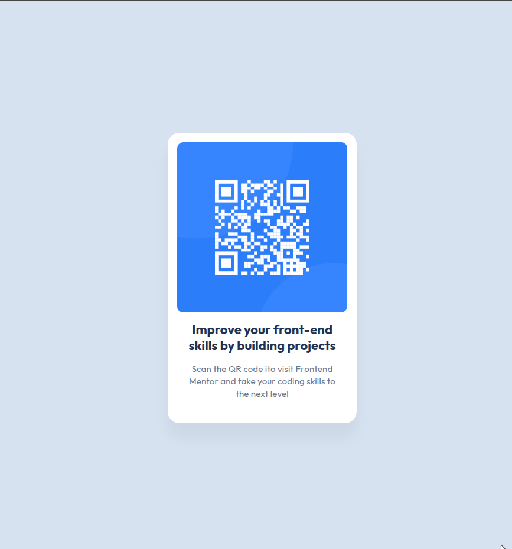

# Frontend Mentor - QR Code Component Solution

This is my solution for the **QR Code Component** challenge on [Frontend Mentor](https://www.frontendmentor.io/challenges/qr-code-component-iux_sIO_H). The challenge is to build a simple QR code component that closely matches the provided design.



## 🚀 Overview

### ✨ Features:
- Fully responsive design
- Clean and minimal UI
- Mobile-first approach
- Accessible and semantic HTML

## 🔧 Technologies Used

- HTML5
- CSS3 (Flexbox)

## 📂 Project Structure

```
├── index.html
├── images/
│   ├── qr-code.png
│   ├── favicon-32x32.png
│   ├── image-qr-code.png
├── README.md
```

## 🌎 Live Preview
You can view the live solution here: [Live Demo]()

## 📸 Screenshot


## 🛠️ Installation & Usage
1. Clone the repository:
   ```sh
   git clone https://github.com/big-hero-dev/FM-01-qr-code-component.git
   ```
2. Open `index.html` in your browser.

## 🎯 What I Learned
- Structuring a simple component-based layout.
- Using Flexbox for alignment.
- Improving CSS styling techniques.

## 📜 License
This project is licensed under the MIT License.

---
Challenge by [Frontend Mentor](https://www.frontendmentor.io/), coded by **Khanh Tran**.

