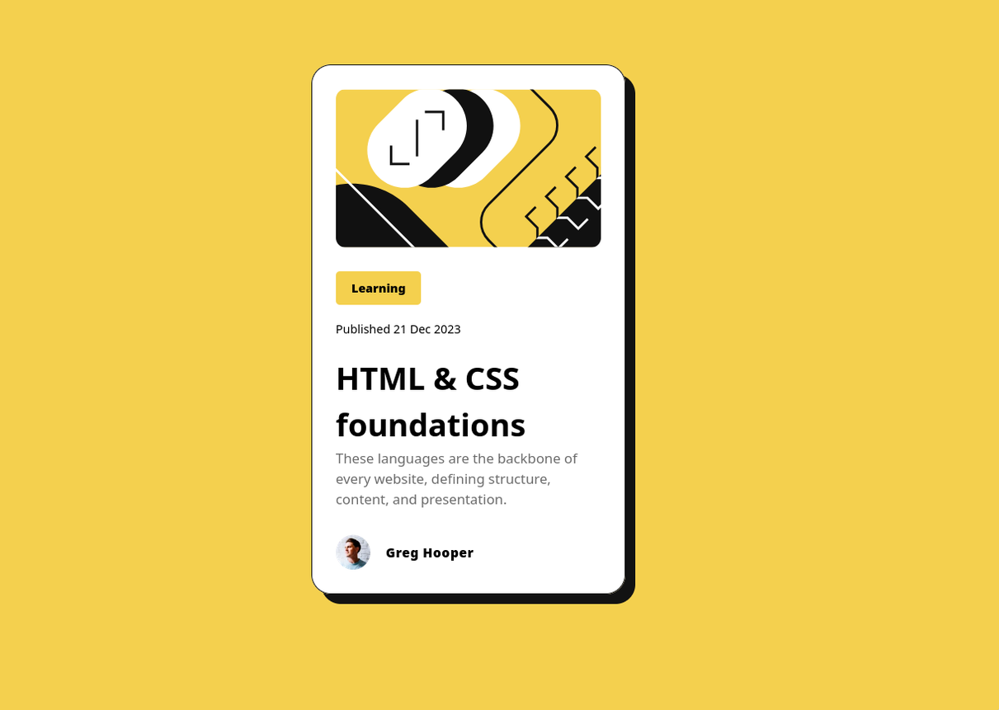

# Frontend Mentor - Blog Preview Card Solution

This is my solution for the **Blog Preview Card** challenge on [Frontend Mentor](https://www.frontendmentor.io/challenges/blog-preview-card-ckPaj01IcS). The challenge is to build out this blog preview card and get it looking as close to the design as possible.

## 🚀 Overview

### ✨ Features:
- Fully responsive design
- Clean and minimal UI
- Mobile-first approach
- Accessible and semantic HTML

## 🔧 Technologies Used

- HTML5
- CSS3 (Grid)

## 🌎 Live Preview
You can view the live solution here: [Live Demo](https://big-hero-dev.github.io/fm-challenges/blog-preview-card)

## 🎯 What I Learned
- Structuring a simple component-based layout.
- Using Grid for alignment.
- Improving CSS styling techniques.

## 📜 License
This project is licensed under the MIT License.

---
Challenge by [Frontend Mentor](https://www.frontendmentor.io/), coded by **Khanh Tran**.

